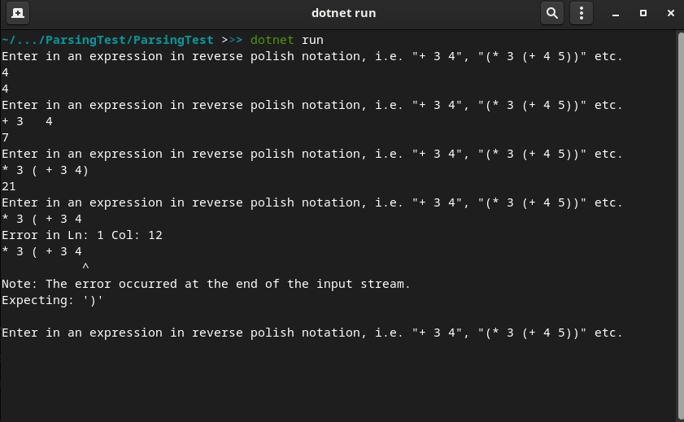

# RPNParser

A reverse Polish notation parser written in F# using FParsec. 

## The parser in action

## Characteristics

- Uses `+`, `*`, `-`, and `/` operations
- Treats numbers as floats
- Parenthesis are optional, but must be balanced
- Handles compound expressions i.e. `+ 3 * 4 5`.